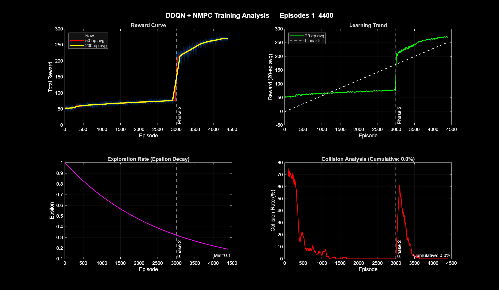

# Autonomous Highway Driving with Hybrid DDQN + NMPC Architecture

A MATLAB-SUMO co-simulation framework for autonomous highway driving, combining **Double Deep Q-Network (DDQN)** for high-level decision making with **Nonlinear Model Predictive Control (NMPC)** for low-level motion planning.

> Inspired by: *Albarella et al., "A Hybrid Deep Reinforcement Learning and Optimal Control Architecture for Autonomous Highway Driving," Energies, 2023.*

---

## Overview

The system operates in a two-layer hierarchical architecture:

```
┌─────────────────────────────────────────────────┐
│                    MATLAB                        │
│                                                  │
│  ┌─────────────┐        ┌──────────────────┐    │
│  │ DDQN Agent  │───────▶│  NMPC Controller │    │
│  │ (Decision)  │eyref,TH│ (Motion Planning)│    │
│  └──────┬──────┘        └────────┬─────────┘    │
│         │ state s(t) ∈ ℝ¹⁹       │ u2 = setSpeed│
└─────────┼───────────────────────┼──────────────┘
          │        TraCI           │
          │      port 8813         │
┌─────────▼───────────────────────▼──────────────┐
│                    SUMO                          │
│         ego vehicle + background traffic         │
└─────────────────────────────────────────────────┘
```

**DDQN** observes a 19-dimensional state vector and selects one of 5 driving actions. **NMPC** converts these decisions into optimal longitudinal control commands while enforcing vehicle dynamic constraints. Lane changes are executed directly via TraCI's `changeLane()` command.

---

## Repository Structure

```
highway_sim/
│
├── training/                   ← DDQN training system
│   ├── ddqn_agent.m            # Main training loop (DDQN + NMPC)
│   ├── ddqn_create_network.m   # Neural network architecture
│   ├── update_network.m        # Network update with Adam optimizer
│   ├── ReplayBuffer.m          # Experience replay buffer (classdef)
│   └── episode_analysis.m      # Episode data visualization
│
├── env/                        ← Simulation environment
│   ├── step_environment.m      # Action → NMPC reference conversion
│   ├── get_state_vector.m      # State vector reading via TraCI
│   └── compute_reward.m        # Reward function
│
├── nmpc/                       ← NMPC controllers
│   ├── nmpc_longitudinal_create.m  # Longitudinal NMPC setup
│   ├── longitudinal_dynamics.m     # Longitudinal state equations
│   ├── longitudinal_cost.m         # Longitudinal OCP cost function
│   ├── nmpc_lateral_create.m       # Lateral NMPC setup
│   ├── lateral_dynamics.m          # Lateral state equations (bicycle model)
│   └── lateral_cost.m              # Lateral OCP cost function
│
├── sumo/                       ← SUMO network definitions
│   ├── highway.net.xml         # Compiled road network (50 km, 3 lanes)
│   ├── highway.node.xml        # Node definitions
│   ├── highway.edg.xml         # Edge definitions
│   └── highway.rou.xml         # Vehicle routes and traffic flows
│
├── test/                       ← Testing and analysis scripts
│   ├── test_agent.m            # Visual test of trained agent (epsilon=0)
│   ├── main_simulation.m       # Raw TraCI connection test
│   ├── plot_final_analysis.m   # Training analysis plots (ep4400)
│   └── plot_training.m         # Training progress plots
│
├── models/                     ← Saved models
│   ├── ddqn_ep4400.mat         # ✓ Tracked in version control (final model)
│   └── ddqn_ep*.mat            # ✗ Excluded via .gitignore (checkpoints)
│
├── results/                    ← Generated figures (.gitignore excluded)
│   └── egitim_analizi_4400.png
│
└── lib/                        ← Third-party libraries (.gitignore excluded)
    ├── traci4matlab_full.jar
    └── pipeacosta-traci4matlab-245ddc7/
```

---

## Requirements

### Software
| Tool | Version | Purpose |
|---|---|---|
| MATLAB | R2024a or later | Training, NMPC design |
| MATLAB Deep Learning Toolbox | — | DDQN neural network |
| MATLAB MPC Toolbox | — | NMPC controllers |
| SUMO | 1.26.0 | Traffic simulation |
| Java (JRE) | 8+ | TraCI communication |

### MATLAB Path Setup
Before running any script, add the following to your MATLAB path:

```matlab
addpath('path/to/highway_sim/training');
addpath('path/to/highway_sim/env');
addpath('path/to/highway_sim/nmpc');
addpath('path/to/highway_sim/lib/pipeacosta-traci4matlab-245ddc7');
javaaddpath('path/to/highway_sim/lib/traci4matlab_full.jar');
java.lang.System.setProperty('java.net.preferIPv4Stack', 'true');
```

> **Important:** Adding the JAR file alone is not sufficient. The `+traci` folder inside the traci4matlab directory must also be on the MATLAB path.

---

## Quick Start

### 1. Test the TraCI Connection

Run `test/main_simulation.m` to verify MATLAB-SUMO communication:

```matlab
>> main_simulation
```

Expected output:
```
Connection SUCCESSFUL!
Step 6 | EGO: 20.0 m/s | Front: 32.3 m ahead
Step 7 | EGO: 23.0 m/s | Front: 34.5 m ahead
...
```

### 2. Run the Visual Test (Pre-trained Agent)

Load the final model and watch the agent drive:

```matlab
>> test_agent
```

This runs the trained agent with `epsilon = 0` (pure exploitation, no randomness) for 1000 steps (~200 seconds of simulation) using SUMO-GUI.

### 3. Resume Training from Checkpoint

```matlab
>> ddqn_agent
% Checkpoint found: ddqn_ep4400.mat
% Continue? (y/n): y
```

Training will resume from episode 4400 with saved network weights, epsilon value, and replay buffer statistics.

### 4. Start Fresh Training

```matlab
>> ddqn_agent
% Checkpoint found: ddqn_ep4400.mat
% Continue? (y/n): n
% Starting from scratch...
```

---

## System Architecture

### State Vector — s(t) ∈ ℝ¹⁹

The DDQN agent observes a 19-dimensional state vector at each simulation step:

| Index | Variable | Description |
|---|---|---|
| s(1) | v(t) | Ego vehicle speed [m/s] |
| s(2–7) | s₁ⱼ, j=1..6 | Longitudinal distance to 6 neighbors [m] |
| s(8–13) | s₂ⱼ, j=1..6 | Lateral distance to 6 neighbors [m] |
| s(14–19) | s₃ⱼ, j=1..6 | Relative speed to 6 neighbors [m/s] |

Neighbor ordering: left-front (j=1), center-front (j=2), right-front (j=3), left-rear (j=4), center-rear (j=5), right-rear (j=6). If a neighbor is beyond sensor range (100 m), a dummy value of 100 m is used.

### Action Space — a ∈ {1, 2, 3, 4, 5}

| Action | Description | NMPC Effect |
|---|---|---|
| a=1 | Change lane left | eyref += Lw |
| a=2 | Keep lane | eyref unchanged |
| a=3 | Change lane right | eyref -= Lw |
| a=4 | Accelerate | TH -= ΔTH (closer following) |
| a=5 | Brake | TH += ΔTH (larger following distance) |

### Reward Function

```
r_t = r_v - r_lc - r_ttc - r_coll
```

| Component | Value | Trigger |
|---|---|---|
| r_v | 1 - \|v_des - v(t)\| / v_des | Always (speed tracking reward) |
| r_lc | 1 | Lane change actions (a=1 or a=3) |
| r_ttc | 20 | Time-to-collision < 2 seconds |
| r_coll | 100 | Distance to leader < 2 m → episode ends |

---

## NMPC Design

### Longitudinal NMPC
Controls ego speed and following distance.

- **State:** x₂ = [d, Δv, v, a]ᵀ
- **Control input:** u₂ (desired acceleration)
- **Reference:** d_ref = d₀ + TH·v(t), v_ref = 33 m/s
- **Constraints:** a ∈ [-5, 2.4] m/s², v ≤ 35 m/s, d ≥ 2 m

### Lateral NMPC
Controls lane tracking using a kinematic bicycle model in Frenet frame.

- **State:** x₁ = [s, eᵧ, v, eᵩ, δ]ᵀ
- **Control input:** u₁ (steering rate)
- **Constraints:** δ ∈ [-0.35, 0.35] rad, u₁ ∈ [-0.035, 0.035] rad/s

> **Note:** During training, the lateral NMPC is replaced by TraCI's `changeLane()` command for computational efficiency. The lateral NMPC is available for deployment use.

### NMPC Parameters (from Albarella et al. 2023, Table 2)

| Parameter | Value |
|---|---|
| Sampling time Ts | 0.2 s |
| Prediction horizon p | 5 steps (1.0 s) |
| Q₂ = diag(q₃, q₄, q₅) | diag(30, 30, 20) |
| Q₁ = diag(q₁, q₂) | diag(50, 50) |
| r₂ (longitudinal effort) | 1 |
| r₁ (lateral effort) | 10 |
| d₀ (standstill distance) | 3 m |
| TH range | [0.1, 3.0] s |

---

## Training Details

Training was conducted in two phases with increasing difficulty:

### Phase 1 — Basic Learning (Episodes 1–3000)
- Traffic density: 800 vehicles/hour
- Episode length: 100 steps (20 seconds)
- Ego departure: fixed position (departPos=0)
- Result: Reward stabilized at 50–75, epsilon: 1.0 → 0.50

### Phase 2 — Dense Traffic (Episodes 3000–4400)
- Traffic density: 1500 vehicles/hour
- Episode length: 300 steps (60 seconds)
- Ego departure: random position (departPos=random)
- Road length extended: 10 km → 50 km (to distinguish road-end from collision)
- Result: Reward jumped to 270+ (+440%), epsilon: 0.50 → 0.19

### DDQN Hyperparameters

| Parameter | Value |
|---|---|
| Discount factor γ | 0.99 |
| Learning rate η | 0.0005 (Adam) |
| Replay buffer capacity | 500,000 |
| Mini-batch size | 32 |
| Target network update | Every 20,000 steps |
| Initial epsilon ε₀ | 1.0 |
| Minimum epsilon ε_min | 0.10 |
| Epsilon decay | 2.3026 × 10⁻⁶ |
| Input neurons | 19 |
| Hidden layers | 2 × 128 (ReLU) |
| Output neurons | 5 |

### Training Results



*DDQN + NMPC training analysis (Episode 1-4400): reward curve, 
learning trend, epsilon decay, and collision analysis. 
The dashed white line marks Phase 2 onset (episode 3000).*

| Metric | Value |
|---|---|
| Total episodes trained | 4,400 |
| Reward improvement | +440% (50 → 270) |
| Final epsilon | 0.19 |
| Policy-based decisions | 81% |
| Visual test (epsilon=0) | 200 s, no collision |

---

## SUMO Scenario

| Parameter | Value |
|---|---|
| Road length | 50,000 m |
| Number of lanes | 3 |
| Lane width (Lw) | 3.6 m |
| Maximum speed | 35.0 m/s |
| Background traffic (Phase 1) | 800 vehicles/hour |
| Background traffic (Phase 2) | 1500 vehicles/hour |
| Car-following model | IDM |
| Lane-change model | MOBIL |
| Simulation step | 0.2 s |
| TraCI port | 8813 |

---

## Known Issues and Solutions

### 1. `traci.init` not recognized
**Cause:** JAR file added but `+traci` folder not on MATLAB path.  
**Fix:** `addpath('lib/pipeacosta-traci4matlab-245ddc7')`

### 2. `nlmpcmove` Parameters error
**Cause:** Parameters passed as cell array `{}` instead of numeric vector `[]`.  
**Fix:** Use `onlineData.Parameters = [d0, TH, v_ref]` (numeric vector).

### 3. IP address connection refused
**Cause:** Wi-Fi IP changes between sessions.  
**Fix:** Assign a static IP or update the IP in `ddqn_agent.m` before each session:
```matlab
traci.init(8813, 10, '192.168.x.xxx');  % update with your IP
```

### 4. False collision detection (road-end issue)
**Cause:** Ego vehicle reaching road end was incorrectly counted as a collision.  
**Fix:** Road extended to 50 km and collision detection now distinguishes early termination (step < 480) from road-end termination (step ≥ 480).

### 5. Slow training due to NMPC
**Cause:** `fmincon` solver is ~40–100× slower than FORCES Pro.  
**Fix:** Prediction horizon reduced to p=5 (from p=20 in paper). For full performance, integrate FORCES Pro (free academic license at embotech.com).

---

## Limitations vs. Original Paper

| Aspect | This Work | Albarella et al. (2023) |
|---|---|---|
| Training episodes | 4,400 | 60,000 |
| NMPC solver | fmincon (SQP) | FORCES Pro |
| Prediction horizon | p=5 | p=20 |
| Lateral NMPC in training | Disabled (changeLane) | Active |
| Training time | ~72 hours (CPU) | ~20 hours (GPU + FORCES Pro) |
| Final collision rate | ~0% (visual test) | ~4% (reported) |

---

## References

[1] N. Albarella, D. G. Lui, A. Petrillo, and S. Santini, "A Hybrid Deep Reinforcement Learning and Optimal Control Architecture for Autonomous Highway Driving," *Energies*, vol. 16, no. 8, p. 3490, Apr. 2023.

[2] Eclipse SUMO, "Simulation of Urban MObility," v1.26.0. https://sumo.dlr.de

[3] F. Acosta, "traci4matlab," GitHub. https://github.com/pipeacosta/traci4matlab

[4] H. van Hasselt, A. Guez, and D. Silver, "Deep Reinforcement Learning with Double Q-learning," *Proc. AAAI*, 2016.

[5] R. Rajamani, *Vehicle Dynamics and Control*, Springer, 2011.

---

## License

This project was developed for academic purposes as part of a Pattern Recognition course project. The implementation is based on the architecture proposed by Albarella et al. (2023).